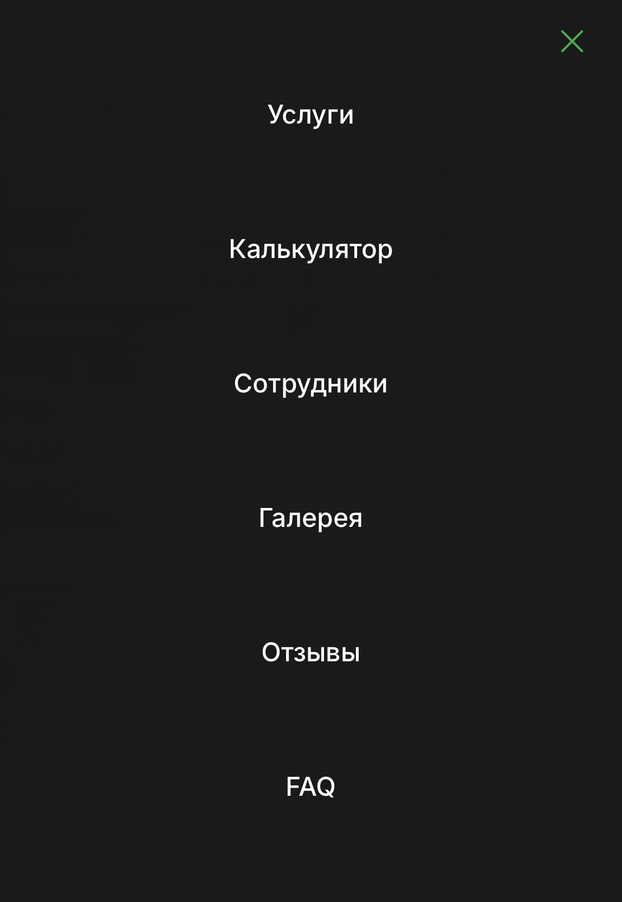

# 🧹 Cleanzy — Профессиональный сервис уборки

[](https://antgalanin06.github.io/Cleanzy_website/)

## 📋 О проекте

Cleanzy — это современный лендинг для сервиса профессиональной уборки. Сайт предлагает полный спектр услуг по уборке квартир, домов и офисов с удобным онлайн-калькулятором стоимости и системой заказа.

### 🚀 Основные возможности

- 💰 Интерактивный калькулятор стоимости услуг
- ⭐ Система отзывов с рейтингом
- 🖼️ Галерея работ "до/после"
- ❓ Раздел FAQ с ответами на частые вопросы
- 📱 Полностью адаптивный дизайн
- ⚡ Быстрая загрузка и оптимизированная производительность

## 🛠️ Технологии

<div align="center">
  
  
  
  
  
  
  
  
  
</div>

### Frontend
- **Vue.js 3** - современный фреймворк для создания пользовательских интерфейсов
- **JavaScript (ES6+)** - основной язык программирования
- **HTML5** - семантическая разметка
- **CSS3** - стилизация и анимации
- **Vite** - быстрый сборщик проекта
- **FontAwesome** - иконки через CDN

### Backend
- **Node.js** - серверная платформа
- **Express.js** - веб-фреймворк
- **JSON** - формат данных для хранения заказов
- **REST API** - архитектура взаимодействия

### Адаптивность
- 📱 Мобильная версия (до 480px)
- 📱 Планшетная версия (480px - 1150px)
- 🖥️ Десктопная версия (от 1150px)
- 🎯 Поддержка всех современных браузеров

## 🖼️ Скриншоты

<div align="center">
  
</div>

### 📱 Адаптивные версии
<div style="display: grid; grid-template-columns: 48% 48%; gap: 4%; justify-content: center;">
  <div>
    
  </div>
  <div style="display: flex; flex-direction: column; gap: 20px;">
    
    
  </div>
</div>

## 🏗️ Структура проекта

```
Cleanzy_website/
├── .github/               # GitHub конфигурация
│   └── workflows/        # GitHub Actions
│
├── .vscode/              # Настройки VS Code
│   └── settings.json     # Пользовательские настройки
│
├── public/               # Публичные ассеты
│   └── images/          # Изображения
│       └── screens/     # Скриншоты для документации
│
├── src/                  # Исходный код
│   ├── assets/          # Ассеты
│   │   ├── main.css    # Основные стили
│   │   └── base.css    # Базовые стили
│   │
│   ├── components/      # Vue-компоненты
│   │   ├── landing/    # Компоненты лендинга
│   │   │   ├── HeaderBlock.vue      # Шапка сайта
│   │   │   ├── HeroBlock.vue        # Главный экран
│   │   │   ├── BenefitsBlock.vue    # Блок преимуществ
│   │   │   ├── WhyUsBlock.vue       # Почему мы
│   │   │   ├── PriceCalc.vue        # Калькулятор цен
│   │   │   ├── TestimonialsSlider.vue # Отзывы
│   │   │   ├── BeforeAfterSlider.vue  # До/После
│   │   │   ├── FaqAccordion.vue     # FAQ
│   │   │   ├── FooterBlock.vue      # Подвал
│   │   │   ├── TermsOfService.vue   # Условия
│   │   │   └── PrivacyPolicy.vue    # Политика
│   │   │
│   │   ├── common/     # Общие компоненты
│   │   │   └── Modal.vue           # Модальные окна
│   │   │
│   │   └── icons/      # Иконки
│   │
│   ├── pages/          # Страницы
│   │   └── Home.vue    # Главная страница
│   │
│   ├── plugins/        # Плагины
│   │   └── fontawesome.js # FontAwesome
│   │
│   ├── router/         # Роутинг
│   │   └── index.js    # Конфигурация маршрутов
│   │
│   ├── App.vue         # Корневой компонент
│   └── main.js         # Точка входа
│
├── server.js            # Бэкенд на Node.js
├── orders.json          # База данных заказов
├── index.html           # Главный HTML
├── package.json         # Зависимости
├── package-lock.json    # Фиксация версий
├── vite.config.js       # Конфигурация Vite
├── jsconfig.json        # Конфигурация JS
├── .gitignore          # Игнорируемые файлы
├── LICENSE             # Лицензия
└── README.md           # Документация
```

## 🚀 Быстрый старт

1. **Клонируйте репозиторий:**
   ```bash
   git clone https://github.com/AntGalanin06/Cleanzy_website.git
   cd Cleanzy_website
   ```

2. **Установите зависимости:**
   ```bash
   npm install
   ```

3. **Запустите проект в режиме разработки:**
   ```bash
   npm run dev
   ```

4. **Запустите бэкенд:**
   ```bash
   node server.js
   ```

5. **Соберите проект для продакшена:**
   ```bash
   npm run build
   ```

## ✨ Особенности реализации

### Frontend
- 🎨 Современный дизайн с анимациями
- 📱 Адаптивная верстка для всех устройств
- ⚡ Оптимизированная производительность
- 🔍 SEO-friendly структура
- 🎯 Удобный UX/UI

### Backend
- 🔒 Безопасная обработка заказов
- 📊 Хранение данных в JSON
- 🚀 Быстрый API
- 📝 Логирование действий
